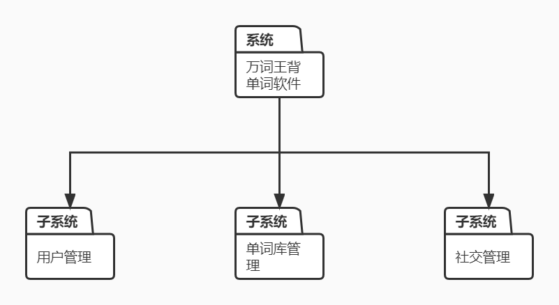
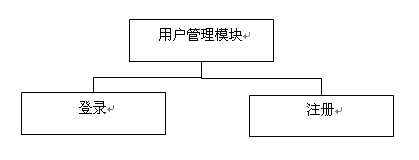

# Lab Week 11: Preparing Architectural Design Specification

## 一、引言

​	目前全球化趋势日益增强，英语地位日趋重要，每个学生以及工作者都需要具备与国际接轨的能力，英语是基础，单词更是英语的基础，而背单词困扰着许多人。英语单词多而繁杂，开始记忆以后如果没有安排恰当计划，零散的记忆，效率低下，久而久之看不见成果，便缺乏动力。

​	背单词软件随着人们背单词需求应运而生，可以充分调用人们的碎片化时间进行单词记忆，既节省了时间为人们带来了方便，也提升了人们的英语水平。

### 1.1	标识

本软件适用于Windows操作系统使用。

| 报告编号 | 万词王单词记忆软件概要设计说明书 |
| :------: | :------------------------------: |
| 当前版本 |               V1.0               |
|  编写人  |       梁睿凯、李胤峰、李钰       |
|  审批人  |           小组所有成员           |
| 编写日期 |            2022-4-29             |
| 审批日期 |            2022-4-29             |

### 1.2	软件概述

​	背单词本质就是通过记忆的技巧来克服遗忘。遗忘的本质是记忆元素之间的链结弱化甚至消失，导致人们回忆不起某个记忆元素。根据双重遗忘理论，人们不仅仅是忘记了单词本身，还会忘记了今天自己该复习什么单词双重遗忘让我们错失了将单词从短期记忆转化成长期记忆的机会。而记忆和遗忘相互制衡并存存在规律性，这就是著名的“艾宾浩斯遗忘原理”也就是“记忆曲线”或者“遗忘曲线”。众所周知，要记住一样东西必须反复的复习重复，才能达到牢记状态，而艾宾浩斯遗忘原理告诉我们遵循记忆与遗忘的规律进行复习，将会事半功倍。

​	万词王单词记忆软件是一款帮助高效记忆单词的软件，具有十分光明的前景与商业价值。除此之外，因为目前移动端的背单词软件市场已经基本饱和，所以转向PC端软件的开发，以弥补市场空缺。

### 1.3	文档概述

通过本项目的系统分析，可以深入了解软件系统的开发内容和开发过程。将所学的框架开发技术运用到本项目中去，后台使用数据库SQL Server。

### 1.4	基线

1. 万词王单词记忆软件开发计划书 V1.0
2. 万词王单词记忆软件需求分析报告 V1.0
3. 万词王单词记忆软件测试计划 V1.0

## 二、引用文件

中华人民共和国国家标准GB T-8567-2006

## 三、总体设计

### 3.1	基本功能

- 用户信息管理功能：用户手册，用户登录功能，用户选择记忆词库信息。
- 词库书籍分类显示功能：按词汇书的类别分别显示相应信息，例如4级词汇、6级词汇、高考词汇等。
- 词库书籍选择功能：在词库显示界面中，用户可以选择需要记忆的书籍，并制定每日计划单词量。
- 记忆单词功能：通过选定的词库给用户每次展示一定数量的单词进行记忆。
- 打卡功能：用户完成每日计划记忆单词后可以选择是否打卡，打卡内容将分享到社交空间。

### 3.2	附加功能

- 用户帐号管理功能：管理人员能够列表显示用户的帐号信息，禁用或删除选定的用户帐号。
- 词库书籍载入功能：通过给定的输入格式，管理人员可以将词书载入软件数据库。

### 3.3	运行环境

硬件要求：4核处理器及以上，512M内存及以上，至少10G硬盘

网络状况良好

### 3.4	基本设计概念和处理流程

该背单词应用程序对应着一个C++应用程序类型的解决方案。包括以下几大模块：

- 用户管理模块
  	账号注册
  	账号登录

- 单词库管理模块

  ​	单词数据库增加

  ​	单词数据库删除

  ​	单词数据库查询

  ​	单词数据库修改

- 社交管理模块

  ​	成果分享

  ​	实时排名

整个项目结构如下图所示：

## 四、各模块结构

### 4.1	用户管理模块

用户管理模块实现用户帐号的注册与登录功能。

### 4.2	单词库管理模块

单词库管理模块实现多个单词数据库的增删改查。

### 4.3	社交管理模块

社交管理模块实现用户的学习成果分享功能，并提供实时排名。

## 五、利用SQL Server设计数据库

### 5.1	创建数据库：sqlWordMeM

### 5.2	创建表

**表一：User**

| 序号 |   列名   |   数据类型   | 长度 | 小数位 | 标识 | 主键 | 允许空 | 默认值 | 说明 |
| :--: | :------: | :----------: | :--: | :----: | :--: | :--: | :----: | :----: | :--: |
|  1   |  userID  |     int      |      |   0    |      |  √   |        |        |      |
|  2   | username | nvarchar(10) |      |   0    |      |  √   |        |        |      |
|  3   | userpwd  | nvarchar(20) |      |   0    |      |      |        |        |      |
|  4   |  E-mail  |   nvarchar   |      |   0    |      |      |        |        |      |

**表二：Word**（需要创建多个单词表，对应单词表的名称为对应词库名称）

| 序号 |  列名   |   数据类型    | 长度 | 小数位 | 标识 | 主键 | 允许空 | 默认值 | 说明 |
| :--: | :-----: | :-----------: | :--: | :----: | :--: | :--: | :----: | :----: | :--: |
|  1   |  word   | nvarchar(30)  |      |   0    |      |  √   |        |        |      |
|  2   | meaning | nvarchar(100) |      |   0    |      |      |        |        |      |

## 六、数据库安全性

### 6.1	概述

基于项目特点，项目的安全控制主要由程序代码控制。SQL Server端没有特殊地设定安全设置和检查。项目的用户身份验证、用户授权管理都由应用程序代码实现。

### 6.2	数据库验证方式

应用程序端连接数据库时使用的数据库验证方式为SQL Server验证

## 七、数据库管理和设置

### 7.1	概述

本节内容与数据库功能无关，将从系统的数据库运行角度出发，对本数据库的属性设置和备份恢复策略提出指导性说明。

### 7.2	数据库属性设置

为了保障数据的安全和可用性，将数据库的故障还原模块设定为完全。

### 7.3	数据库备份恢复策略

数据库的大小和数据修改的频率决定了采用何种数据库备份恢复策略。如果数据库较小或修改的频率非常低，则可以只实施完全数据库备份，不过此时要定期清理数据库的事务日志，防止数据库的事务日志被填满。其他情况则需要使用差异备份。

## 八、注释

### 8.1	参考资料

- [1]张海藩，《软件工程导论》，清华大学出版社 2003.12

  
