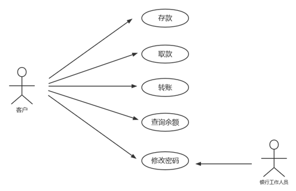
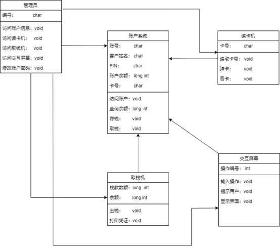
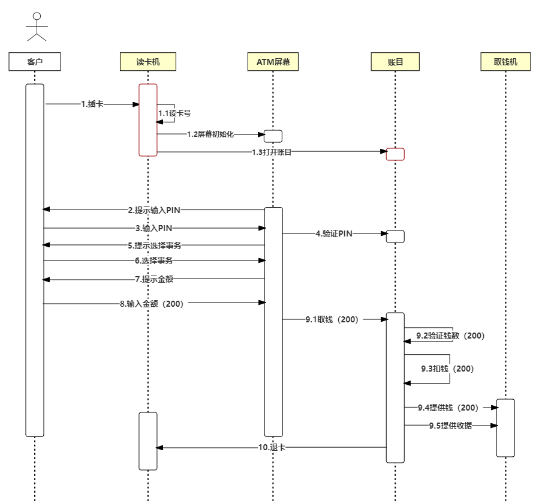
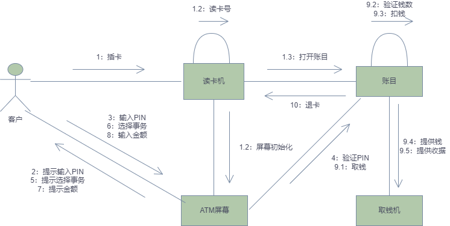
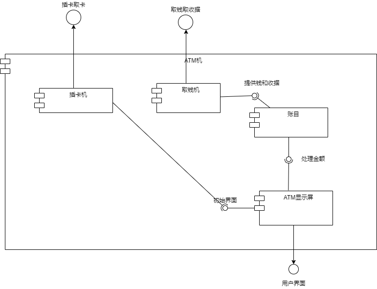
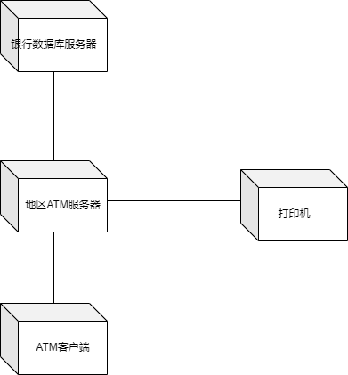

# Lab Week 04：Practicing UML

|  姓名  |   学号   |        负责内容        |
| :----: | :------: | :--------------------: |
| 梁睿凯 | 19335121 | 协作图、部署图、构件图 |
|  李钰  | 19335112 |  用例图、类图、对象图  |
| 李胤峰 | 19335144 | 活动图、状态图、序列图 |

## 一、实验内容

- 分析ATM自动取款机的主要业务逻辑，绘制其九种结构类和行为类的UML模型图并给出适当的说明。
- 利用git仓库进行版本管理。

## 二、实验报告

### 2.1	用例图

用例图展现了一组用例、参与者以及它们之间的关系。可以用用例图描述系统的静态使用情况。

对于ATM机服务的客户来说，他可以进行存款、取款、转账、查询余额、修改密码等用例。银行的工作人员也可以启动修改账户密码这个用例。

### 2.2	类图

类图展示了一组类、接口和协作及它们之间的关系，在建模中所建立的最常见的图就是类图。系统可有多个类图，单个类图仅表达了系统给的一个方面。一般在高层给出类的主要职责，在低层给出类的属性和操作。

在取款这个用例中各个类之间的关系，由五个类完成：管理员、账户系统、交互屏幕、读卡机和取钱机。类图中每个类都是用方框表示的，分成三个部分。第一部分是类名；第二部分是类包含的属性，属性是类和相关的一些信息，如账户系统类包含了五个属性：账号、该账户姓名、PIN(密码)、账户余额以及账户所拥有的卡号；最后一部分包含类的方法，方法是类提供的一些功能，例如帐目类包含了四个方法：访问账户、查询余额、取钱、存钱。 类之间的连线表示了类之间的关联关系。例如，账户系统连接了交互屏幕，因为两者之间要直接相互通信，通过屏幕获取的操作编号在相应账户中进行对应的操作；取钱机和读卡机不相连，因为两者之间不进行通信。

### 2.3	对象图

对象图是类图的变体，它使用与类图相似的符号描述，不同之处在于对象图显示的是类的多个对象实例而非实际的类。可以说，对象对是类图的一个例子，用于显示系统执行时的 一个可能的快照，即在某一时间点上系统可能呈现的样子。

对象图与类图表示的不同之处在于它用带下划线的对象名称来表示对象，显示一个关系中的所有实例。

下面举例：一个名为“张三”的客户想要进行取钱功能。通过读卡机“reader1”，ATM机获取了他的卡号为“654321”，接着访问到对应账户，获取其详细信息；通过“ATM_screen”获取客户想要进行取钱操作——编号为1；之后取钱机获取取钱金额，按需提供相同金额的钱。过程中管理员“Adm1”进行监督，若遇到问题可向管理员进行反馈。

### 2.4	状态图

描述类的对象所有可能的状态以及事件发生时状态的转移条件，状态图是对类图的补充。通过状态图可以无歧义的了解各个活动角色是如何在不同状况下转换的，转换的条件是什么，是否会出现死锁现象，是否有条件没考虑周全，是否有状态无法达到。状态图可以帮助我们发现问题，并及时改正。

ATM状态图中包含了客户在ATM机上进行操作会经历的几种状态，及各种状态之间转换的条件。除了等待顾客插入磁卡的起始状态和结束服务的终止状态，顾客会处于输入密码、选择服务类型、存款及取款四种状态。状态图如下所示：

### 2.5	活动图

属于行为图的一种，状态图的一个变体，显示了系统从一个活动到另一个活动的流程。活动图显示一些活动强调的是对象之间的流程控制。能够演示出系统中哪些地方存在功能，以及这些功能和系统中其他组件的功能如何共同满足商务需求。

在ATM自动取款机中，客户插入信用卡之后，ATM系统运行了三个并发的活动：验证卡、验证PIN(密码)和验证余额。当三个验证都结束之后，ATM系统根据这三个验证的结果来执行下一步的活动。如果卡正常、密码正确且通过余额验证，则ATM系统接下来询问客户的要求以及执行什么操作。如果以上三种验证有任何一个通不过的话，ATM系统就把相应的出错信息在ATM屏幕上显示给客户。UML活动图如下所示：

### 2.6	序列图

属于交互图的一种，显示对象之间的动态合作关系，它强调对象之间消息发送的顺序，同时显示对象之间的交互。

对取款这个用例分析：它有很多可能的情况，例如想取钱而没钱，想取钱而PIN错等等，正常的情况是取到了钱。下面的序列图就对某客户取200元，分析它的序列图。 序列图的顶部一般先放置的是取款这个用例涉及的参与者，然后放置系统完成取款用例所需的对象，每个箭头表示参与者和对象或对象之间为了完成特定功能而要传递的消息。 取款这个用例从客户把卡插入读卡机开始，然后读卡机读卡号，初始化ATM屏幕，并打开客户的账目对象。屏幕提示输入PIN，客户输入PIN，然后屏幕验证PIN与账目对象，发出相符的信息。屏幕向客户提供选项，客户选择取钱，然后屏幕提示客户输入金额，选择200元。然后屏幕从账目中取钱，启动一系列账目对象要完成的过程。首先，验证客户账目中至少有200元；然后，它从中扣掉200元，再让取钱机提供200元的现金。客户的账目还让取钱机提供收据，最后它让读卡机退卡。UML时序图如下：

### 2.7	协作图

协作图在对一次交互中有意义的对象和对象间的连接建模，它强调收发消息对象的组织结构，按组织结构对控制流建模。除了显示消息的交互之外，还显示对象以及它们之间的关系。协作图与时序图在语义上是等价的，二者可以相互转换而不会丢失信息，故由上述时序图转换而来。、

### 2.8	构件图

构件图由构件，接口，实现和依赖四部分组成。描述代码构件的物理结构以及各种构件之间的依赖关系。用来建模软件的组件及其相互之间的关系。ATM机包括ATM屏幕，插卡机，账目，取钱机四个组件。各个组件之间依赖于彼此提供的接口从而实现存取钱服务。

### 2.9	部署图

部署图用来描述位于节点实例上的运行组件实例的安排，描述系统的实际物理结构。节点是一组运行资源，如计算机、设备或存储器，节点用立方体图形表示。如图所示ATM系统的配置图显示的主要内容包括两个ATM Server，一个地区ATM服务器，银行数据库服务器，一个打印机以及表示通信的连接。

