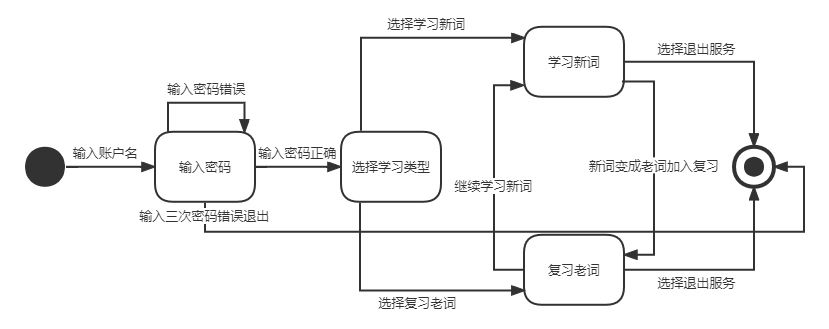
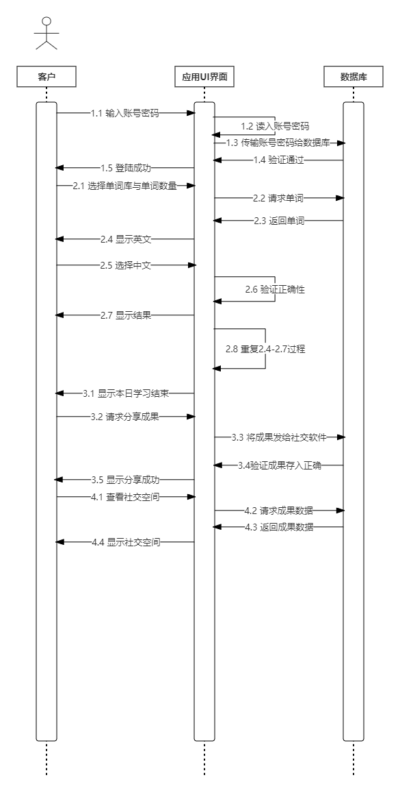
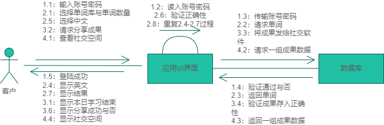

# Lab Week 09: Applying UML for SRS

| 姓名   | 学号     | 负责内容                          |
| ------ | -------- | --------------------------------- |
| 梁睿凯 | 19335121 | 软件需求规格说明书                  |
| 李钰   | 19335112 | 软件项目需求分析报告(2.2.3)         |
| 李胤峰 | 19335144 | 软件需求规格说明书(2.2.1、2.2.2)    |

## 一、实验内容

- 准备软件项目需求分析报告
  - 准备软件项目需求分析报告的框架，至少包括：成本预算、交付进度、开发方法、质量保证、验收和确认准则、验收规程。
- 准备软件需求规格说明书（SRS）

## 二、实验进度报告

### 2.1 软件项目需求分析报告

#### 2.1.1 成本预算

成本较低，基本只需要耗费人力资源，及实验设备，不需要额外的支出。

#### 2.1.2 交付进度（预计）

- 第7-8周完成软件系统的概要设计（系统的基本处理流程、系统的组织结构、模块划分、功能分配、接口设计、运行设计、数据结构设计和出错处理设计等）
- 第8-9周完成软件系统的详细设计（具体模块所涉及到的主要算法、数据结构、类的层次结构及调用关系，需要说明软件系统各个层次中的每一个程序(每个模块或子程序)的设计考虑）
- 第10-13周完成编码（具体的编写程序工作，分别实现各模块的功能，从而实现对目标系统的功能、性能、接口、界面等方面的要求）
- 第14-15周测试与修改（按照测试范围，可以分为模块测试和整体联调；按照测试条件，可以分为正常操作情况测试和异常情况测试；按照测试的输入范围，可以分为全覆盖测试和抽样测试。）
- 第16-18周软件交付（提交开发的目标安装程序、数据库的数据字典、《用户安装手册》、《用户使用指南》、需求报告、设计报告、测试报告等双方合同约定的产物。）

#### 2.1.3 开发方法

3人开发小组分工合作，按前端后端划分任务。每人分别负责不同的模块并行进行，实现相应的接口及功能，最后进行代码整合、测试。

#### 2.1.4 质量保证

- 交付之前：通过大量的、不同情境的模拟数据测试，以确保软件的正确性
- 软件投入使用之后：定时进行功能维护，及时获取用户反馈，提供良好的售后服务，必要时更新软件功能。

#### 2.1.5 验证和确认准则

软件交付之前进行正确性检验（重点关注临界情景）：

- 模拟管理者测试
  - 是否可以顺利进行对单词词库的增删查改
  - 是否可以顺利进行对用户帐号数据库的增删查改
  - 是否能够及时在数据库遭到恶意篡改之后进行维护
- 模拟用户测试
  - 复习计划能否正确并及时的更新
  - 复习计划是否依照艾宾浩斯遗忘曲线更新
  - 能否动态更新任务列表中的单词次序
  - 能否为用户提供当前学习状态的排名：例如记背单词个数、坚持学习天数等
  - 能否顺畅提供社交功能

#### 2.1.6 验收规程

1. 软件开发后期进行分模块验收：分别验收数据库、UDP通信、用户界面的相应功能。
2. 软件交付时进行分角色验收：分别以管理者和用户的身份来进行功能测试、使用体验感总结
3. 性能验收：测试同时使用软件的人数峰值及使用的流畅度
4. 根据反馈进行优化改进，最后进行交付。

### 2.2 软件需求规格说明书

#### 2.2.1 引言

##### 2.2.1.1 目的

该软件需求规格说明书描述了“万词王”1.0版本的软件功能性需求和非功能性需求，这一文档计划有实现系统功能和验证系统功能中的项目团队成员来使用。除非在其他地方另有说明，这里指定的所有需求都具有高优先级，而且都要在1.0版本中得以实现。本文档预期读者是：开发经理、技术部经理、项目组所有人员、测试组人员以及验收方相关负责人。

##### 2.2.1.2 范围

该产品的目标旨在打造一款支持PC端使用的背单词应用程序，结合艾宾浩斯遗忘曲线为用户提供基本的记背单词、提醒复习的功能，以及社区交流的功能。

以下以活动图为例：活动图显示一些活动强调的是对象之间的流程控制。能够演示出系统中哪些地方存在功能，以及这些功能和系统中其他组件的功能如何共同满足商务需求。

在本软件中，客户下载软件之后，应用运行了三个并发的活动：验证用户名、验证密码和验证社交软件绑定。当三个验证都结束之后，软件根据这三个验证的结果来执行下一步的活动。如果用户名存在、对应密码正确且通过绑定验证，则软件接下来进行背单词的活动以及之后的分享。如果以上三种验证有任何一个通不过的话，软件就把相应的出错信息在UI界面上显示给客户。

##### 2.2.1.3 定义简写和缩略语言

QT开发环境下的架构——QT架构 开放数据库连接——ODBC

##### 2.2.1.4 引用文件

本说明书引用了开发过程中的开题报告以及可行性报告，可在本开发团队的开发者仓库 https://github.com/liangrk5/SE-course-project/tree/main/report 查看。

##### 2.2.1.5 综述

其余章条包括总体描述部分和具体需求。总体描述部分负责阐述影响产品需求的一般因素，而不叙述具体的需求。具体需求部分包含足够详细的所有软件需求，使设计人员能够设计系统以满足这些需求，并且使测试人员能够测试该系统满足这些需求。

#### 2.2.2 总体描述

##### 2.2.2.1 产品描述

对于用户来说可以实现：

- 浏览单词词库进行学习，并按需将需要记背的单词添加到复习计划中
- 帮助用户实现信息化管理记忆单词的日程安排
- 根据艾宾浩斯遗忘曲线动态调整复习计划
- 根据复习计划初始化提供给用户的任务列表
- 动态更新任务列表中的单词次序
- 为用户提供当前学习状态的排名：例如记背单词个数、坚持学习天数等
- 提供社交功能，用户们一起交流学习经验 产品使用QT架构实现软件界面设计；使用ODBC实现数据库连接；使用TCP通信协议实现在线交流。

以下以状态图为例进行阐述：通过状态图可以无歧义的了解各个活动角色是如何在不同状况下转换的，转换的条件是什么，是否会出现死锁现象，是否有条件没考虑周全，是否有状态无法达到。状态图可以帮助我们发现问题，并及时改正。

本软件状态图中包含了客户在软件上进行操作会经历的几种状态，及各种状态之间转换的条件。除了等待用户输入用户名的起始状态和结束服务的终止状态，顾客会处于输入密码、选择学习类型、学习新词及复习旧词四种状态。状态图如下所示：

##### 2.2.2.2 产品功能

能够根据复习计划正确并及时的更新待背词汇；复习计划能依照艾宾浩斯遗忘曲线更新；软件能够动态更新任务列表中的单词次序；能为用户提供当前学习状态的排名：例如记背单词个数、坚持学习天数等；能顺畅提供社交功能：分享学习成果，相互督促鼓励。

以下以序列图形式展示：序列图显示对象之间的动态合作关系，它强调对象之间消息发送的顺序，同时显示对象之间的交互。

该序列图展示了软件使用过程中可能遇到的一次背单词以及分享学习成果的时序图。首先客户输入账号密码传给应用UI界面，并进行读入，之后再传给账号数据库，验证通过后传回系统UI界面，界面再显示给客户登陆成功，以上是登陆过程。然后是第二个背单词的过程：先由客户选择要背的单词库，然后UI界面向单词库请求单词数据，单词库返还数据。UI显示给客户单词英文，客户选择对应的中文，传回UI界面后验证正确性，将回答结果返还给客户，其他的单词也重复以上的过程。最后是完成每日学习任务后的分享学习成果：UI先显示学习结束，然后由客户自行选择是否分享学习成果。UI将学习成果的数据发送给绑定好的社交软件，社交软件分享后将分享成功的结果发送回UI，向客户显示。

##### 2.2.2.3 用户特点

本产品预期用户为收到初中及以上教育，且有英语学习基础的用户群体。大多数为在校学生，少数为在职人员。

##### 2.2.2.4 约束

开发语言使用C/C++语言，开发组件包括QT架构、ODBC，通信协议使用TCP。软件主要针对windows7、windows10、windows11的用户，windows版本过低的用户可能无法正常使用。

##### 2.2.2.5 假设和依赖关系

本产品依赖于教育部公布的考试词汇大纲，如果词汇大纲变动或者不再公布，将会导致软件无继续正常运行，或者只能使用之前的词汇大纲。此外，产品还依赖于用户授权社交信息，否则将无法正常使用社交功能。

##### 2.2.2.6 需求分配

软件未来版本可能还会加入付费解锁功能，例如解锁新的词汇大纲，或者新的背单词模式。因此需要预留微信支付等付费接口。

#### 2.2.3 具体需求
#### 部署图+组件图

#### 协作图

##### 2.2.3.1 外部接口需求

###### 2.2.3.1.1 用户界面

用户界面是程序中用户能看见并与之交互的部分，设计一个好的用户界面是非常重要的，本设计将为用户提供美观，大方，直观操作简单的用户界面

###### 2.2.3.1.2 硬件接口

本软件不需要特定的硬件或硬件接口进行支撑

###### 2.2.3.1.3 软件接口

运行于Windows10及以上或Ubuntu系统上

###### 2.2.3.1.4 通信接口

基于TCP协议的Client/Server模式

##### 2.2.3.2 功能需求

###### 2.2.3.2.1 用户类别1：使用者

###### 2.2.3.2.1.1 功能需求1.1：登陆系统

用户输入用户名密码，通过软件系统认证，可登录软件

###### 2.2.3.2.1.2 功能需求1.2：展示单词

系统根据用户设定的词汇书籍以及学习计划以及遗忘曲线设置展示给使用者的记背单词。

###### 2.2.3.2.1.3 功能需求1.3：在线交流

用户可以通过用户名寻找其他用户并添加好友，并实现在线聊天。

###### 2.2.3.2.2 用户类别2：管理员

###### 2.2.3.2.2.1 功能需求2.1：登陆系统

用户输入用户名密码，通过软件系统认证，可登陆软件

###### 2.2.3.2.2.2 功能需求2.2：单词管理

添加，更改，删除，查看词汇表的单词

###### 2.2.3.2.2.3 功能需求2.3：系统管理

对系统进行整体维护与管理

##### 2.2.3.3 性能需求

- **处理能力**

  由于是在线单词记忆软件，其处理能力主要考虑系统能承载的最大并发用户数，考虑到设计规模，系统至少能承载的最大并发用户量要求达到$100*\varphi$，$\varphi$ 为0至1的常数，随服务器容量而定

- **响应时间**

  系统应能够快速地响应用户请求，用户使用的响应时间除了与系统响应速度有关，还与网络状况有关，还与网络状况有关。

##### 2.2.3.4 设计约束

无明显设计约束

##### 2.2.3.5 软件系统属性

###### 2.2.3.5.1 安全性

保证向合法用户提供服务，组织非授权用户使用，组织恶意的攻击

###### 2.2.3.5.2 易用性

软件界面整洁明了，便于用户操作使用

###### 2.2.3.5.3 可伸缩性

当用户和数据量增加时，软件系统仍能维持高服务质量。

###### 2.2.3.5.4 鲁棒性

软件在用户进行了非法操作或其他非正常情况发生时，软件系统仍能够正常运行。

###### 2.2.3.5.5 可扩展性

应具有为适应新需求或需求变化为软件增加功能的能力。

##### 2.2.3.6 其他需求

###### 2.2.3.6.1 消息通知需求

1. 该日单词计划未完成，通知。
2. 他人消息未阅读，通知。

###### 2.2.3.6.2 单词记忆量排名需求

对于注册的所有用户，维护一个单词记忆量排名并进行实时更新。
